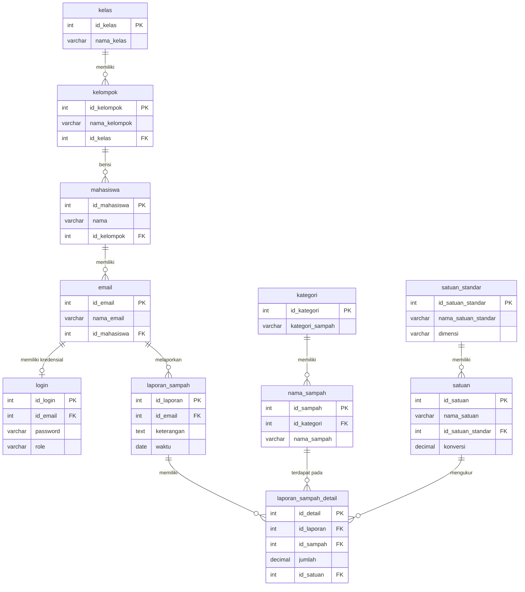

# Entity Relationship Diagram (ERD) 

Dokumen ini berisi Entity Relationship Diagram (ERD) untuk database `smps`

## ER Diagram (Diperbaiki)

## Penjelasan Hubungan Entitas (ERD)

Diagram ERD di atas membagi sistem informasi pemilahan sampah ke dalam tiga alur fungsional utama:

### 1. Alur Organisasi & Pengguna
*   **`kelas` ke `kelompok` (One-to-Many)**: Setiap kelas akademik dapat memiliki banyak kelompok belajar mahasiswa, tetapi setiap kelompok hanya bernaung di bawah satu kelas tertentu.
*   **`kelompok` ke `mahasiswa` (One-to-Many)**: Kelompok belajar menampung banyak mahasiswa, sedangkan tiap mahasiswa hanya boleh menjadi anggota dari satu kelompok.
*   **`mahasiswa` ke `email` (One-to-Many)**: Satu profil mahasiswa dapat mendaftarkan lebih dari satu alamat email (misal: email kampus dan email pribadi) untuk keperluan integrasi atau kontak.
*   **`email` ke `login` (One-to-One / Zero-to-One)**: Setiap alamat email unik yang terdaftar dapat dikaitkan dengan tepat satu akun kredensial password untuk melakukan login ke dalam sistem.

### 2. Alur Transaksi & Pelaporan Sampah
*   **`email` ke `laporan_sampah` (One-to-Many)**: Mahasiswa mengirimkan laporan pemilahan sampah harian/mingguan di bawah identifikasi alamat email mereka. Satu email dapat mengirimkan banyak laporan secara berkala.
*   **`laporan_sampah` ke `laporan_sampah_detail` (One-to-Many)**: Laporan dipecah menjadi dua bagian guna mendukung **input multisampah**. Tabel induk (`laporan_sampah`) menyimpan info umum (keterangan dan waktu), sementara tabel anak (`laporan_sampah_detail`) menyimpan baris-baris rincian jenis sampah yang dilaporkan secara spesifik.

### 3. Alur Master Data & Pengukuran Satuan
*   **`kategori` ke `nama_sampah` (One-to-Many)**: Setiap jenis sampah dikategorikan ke dalam satu klasifikasi besar (seperti Organik, Anorganik, atau B3).
*   **`satuan_standar` ke `satuan` (One-to-Many)**: Mengelompokkan berbagai satuan pengukuran fisik berdasarkan dimensinya (Massa, Kuantitas, Volume) dan mengaitkannya dengan nilai konversi terhadap satuan dasar (Gram, Pcs, ml).
*   **Relasi ke `laporan_sampah_detail`**:
    *   Setiap baris detail laporan sampah mencatat jenis sampah tertentu (`nama_sampah`) dan satuan tertentu (`satuan`) yang dikalikan dengan jumlah desimal (`jumlah`) untuk menghasilkan data pemilahan yang terstandardisasi.

---

